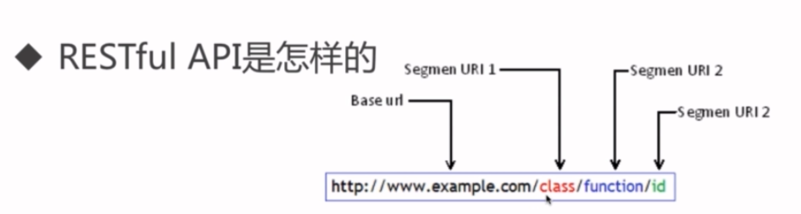
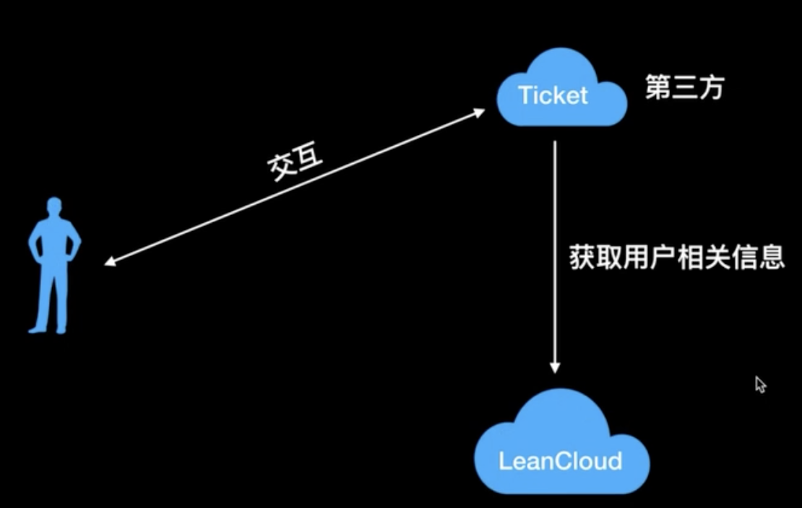

# 目录结构
```
/
|-Core/ 核心目录
  |-Libs/ 核心基础工具类库
  |-Plugins/ 用户自定义工具类库 你也可以帮忙完善该框架项目,到核心基础工具库中
  |-Config/
    |-config.php 默认的配置文件项
  |-Mvc/
    |-Controller.class.php 控制器基类
    |-Model.class.php model基类
    |-View.class.php 视图基类
  |-Core.php 核心文件
|-App/ 项目目录
  |-Config/
    |-config.php 用户自定义的配置项
  |-Controller/
    |-IndexController.class.php Index 控制器
  |-View/
    |-Index/
      |-index.php 对应 IndexController.class.php
  |-Model/
    |-UserCategoryModel.class.php 文件命名方式为大驼峰命名,表的命名方式为 小写加下划线分割
```

# 路由
macaw
# Restful API
## REST, SOAP, RPC 的区别
- RPC 所谓的远程过程调用(面向方法)
- SOA 所谓的面向服务的架构(面向消息)
- REST 所谓的 Representational State transfer (面向资源的请求方式)
## Rest 的 api

## 设置返回的状态码
```
http_response_code(40);
```
[http://php.net/manual/en/function.http-response-code.php](http://php.net/manual/en/function.http-response-code.php)
强制返回状态码描述
```
header($protocol . ' ' . $code . ' ' . $text);
header('HTTP/1.1 404 "页面未找到"');
```
## OAuth
- OAuth (开发授权) 是一个开放标准,允许用户让第三方应用访问该用户在某一网站上存储的私密的资源(如张片,视频,联系人列表),而无需将用户名和密码提供给第三方应用.
- [https://zh.wikipedia.org/wiki/OAuth](https://zh.wikipedia.org/wiki/OAuth)


---


# 命名空间 & 自动加载(惰性加载)
目录结构
```
\
|---Controller/
    |---Login.class.php
|---test.php
```
test.php
```php
<?php
spl_autoload_register(function ($name) {
  var_dump($name);//
  $name = str_replace('\\', '/', $name);
  require $name . '.class.php';
});
Controller\Login::doLogin(); // Controller指的是命名空间,但是在 spl_autoload_register 方法中仅仅是字符串
```
Login.class.php
```php
<?php

namespace Controller;

class Login
{
  static public function doLogin()
  {
    echo 1000;
  }
}
```
## use 和 namespace
1.
```php
<?php
namespace CCC;
AAA::doLogin();//会去找 CCC\AAA::doLogin();
```

从下面这个例子可以看出 use 是切换命名空间的意思.
namespace 只是闭包的概念.
```php
<?php
namespace CCC;
use AAA;
AAA::doLogin(); // 会去找 AAA::doLogin()
?>

<?php
namespace CCC;
use AAA\Person;
Person::doLogin(); // AAA::doLogin();
```

2.
```php
<?php
namespace CCC;
\AAA::doLogin();//会去找根空间中的 AAA::doLogin();
```

3.
```php
<?php
namespace AAA;
use B;
B::doLogin();
```

# access_token
```php
<?php
session_start();
$_SESSION['user_id'] = $uid;
$_SESSION['access_token'] = md5(salt.$_SERVER['REQUEST_TIME'].$uid);
$_SESSION['token_expire'] = md5(salt.$_SERVER['REQUEST_TIME'].$uid);
```
# refresh_token

# Controller 和 Model 的关注点
Model 的关注点是和后端和服务和 DB 和 Cache 打交道去取数据,然后拼装
Controller 是在做入参的检查,和返回值(response)(给前端)的控制

# composer 的用法
```php
{
  "repositories": {
    "packagist": {
      "type": "composer",
      "url": "https://packagist.phpcomposer.com"
    }
  },
  "require": {
    "phpmailer/phpmailer": "v6.0.5",
    "nette/mail": "^2.4"
  }
}

```
使用 compser install 安装写在配置文件中的包

使用 `composer require nette/mail` 去下载包

# 短信接口
```php
$this->allowMethods(['post']);
$smsUser = 'liushuanhua';
$smsPwd = 'password';
$smsapi = new SmsApi($smsUser, $smsPwd);
$contentParam = [
  'code' => rand(0000, 9999)
];
$result = $smsapi->send(15700000000, $contentParam, '100006');
if ($result['stat'] == '100') {
  exit($this->resjson(200, true, '发送成功'));
} else {
  exit($this->resjson(200, false, '发送失败:' . $result['stat'] . '(' . $result['message'] . ')'));
}
```
# 邮件接口
```php
<?php

namespace App\Controller;

use App\Model\UserModel;
use Core\Mvc\Controller;
use Nette\Mail\Message;
use Nette\Mail\SmtpMailer;

class MailController extends Controller
{
  function send()
  {
    $this->allowMethods(['post']);
    $issubmit = I('get.issubmit', false);
    if ($issubmit != 1) {
      exit($this->resjson(400, false, '非正常通道提交!'));
    }
    $email = I('post.email');
    if (!filter_var($email, FILTER_VALIDATE_EMAIL)) {
      exit($this->resjson(200, false, '不是邮箱地址.'));
    }
    $title = I('post.title');
    $contents = I('post.contents');
    if (!$title || !$contents) {
      exit($this->resjson(400, false, '用户 id, 邮件标题, 邮件内容均不能为空.'));
    }

    $user_model = new UserModel();
    $res = $user_model->query('where email = ?', $email)->get();
    if (!$res) {
      exit($this->resjson(200, false, '没有找到该用户'));
    } else {
      $mail = new Message;
//      $mail->setFrom('php 发来的邮件 from username <example@mail.com>','sennka')// 谁发来的
      $mail->setFrom('php 发来的邮件 from username <example@mail.com>')
      ->addTo($email)// 发给谁
      ->setSubject($title)
        ->setBody($contents);

      $mailer = new SmtpMailer([
        'host' => 'smtp.163.com', // smtp 服务器,这里使用的是网易邮箱
        'username' => 'example@mail.com',
        'password' => 'password',
        'secure' => 'ssl'
      ]);
      $rep = $mailer->send($mail);
      var_dump($rep);
    }
  }
}
```


# 其他
## pecl
pecl 是 php 官方的扩展维护的地方
[pecl.php.net](http://pecl.php.net/) 搜索
php 扩展全是 c 开发的
## 安装 redis 扩展

1. 在 [http://pecl.php.net/package/redis](http://pecl.php.net/package/redis) 下载 [redis](http://pecl.php.net/get/redis-4.1.1.tgz)(这是4.1.1稳定版) 扩展
1. 解压 redis.tar.gz
1. 进入解压后的 `redis` 目录
1. phpize 命令 就会在当前目录生成一个 configure 文件
1. 找到 php-config 位置 `which php-config` output `/usr/local/bin/php-config`
1. `./configure --with-php-config=/usr/local/bin/php-config`
1. make && make test
1. make install
1. 修改 `php.ini`
```
[redis]
extension="redis.so"
```
11. 验证 `phpinfo` 查找 redis 是否存在

## 安装 yaf 扩展
1. 找到 php-config 位置
```
which php-config
/usr/local/bin/php-config
```

2. 在 yaf 目录中生成 configure 文件(进入到 yaf 跟目录中)
```
phpize
```

3. 生成配置文件 这个命令会结合你本地的config生成一些用于编译的前期准备
```
./configure --with-php-config=/usr/local/bin/php-config
```
编译后会生成一个 Makefile 文件(也可能没有)

4. make && make test 编译
这一步会通过 gcc 来解析你的 makefile 的内容,编译的过程会把本机需要的包和动态库 link 起来

编译完以后本地会出现一个 yaf.so 的文件,你可以在 yaf 目录中通过 `find ./ -name 'yaf.so'` 找到它

5. make install
编译安装
root@9f2211fb941a:/var/www/html/yaf# php-config | grep extensions
  --extension-dir     [/usr/local/lib/php/extensions/no-debug-non-zts-20170718]
查看扩展 ls /usr/local/lib/php/extensions/no-debug-non-zts-20170718

6. 配置 php.ini
在文件最后面添加
```
[Yaf]
extension=yaf.so
yaf.environ="product"
; 上面这个 yaf.environ="product" 可以要可以不要,你可以自定义
```
7. 重启
